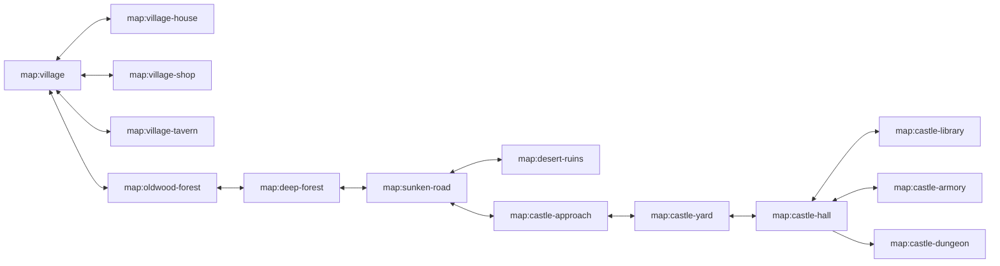

# World Plan

The expanded journey is a storybook road that starts in a village, crosses
forest and desert thresholds, reaches a castle approach, descends into interior
castle spaces, and ends in the dungeon already proven by the vertical slice.
Every new region is content-first: maps live in `src/content/world/maps`,
dialogue and quests live in `src/content/story`, and code only interprets the
content contract.

## Region Map

| Region | Map ids | Role | Tone |
| --- | --- | --- | --- |
| Hearthwake Village | `map:village`, `map:village-house`, `map:village-shop`, `map:village-tavern` | opening hub, tutorial NPCs, save/load mental model | warm vellum, chimney smoke, gentle tune |
| Oldwood Forest | `map:oldwood-forest`, `map:deep-forest` | first combat and branching errand chain | green canopy, rustling percussion, cautious patrols |
| Sunken Road Desert | `map:sunken-road`, `map:desert-ruins` | key hunt, ranged enemies, environmental gates | ochre, low strings, mirage shimmer |
| Castle Approach | `map:castle-approach`, `map:castle-yard` | escalation, guarded gate, exterior siege props | dusk brass, drums, tighter paths |
| Castle Interior | `map:castle-hall`, `map:castle-library`, `map:castle-armory` | exploration, dialogue reveals, locked wings | candlelit stone, echoing arpeggios |
| Dungeon | `map:castle-dungeon` | final combat, rescue, victory | cold stone, low drones, boss pressure |

## Portal Graph

Portal triggers are map triggers with `kind: "portal"`. They must carry:

- `toMap`: destination map id.
- `toSpawn`: named spawn id in the destination map.
- `label`: player-facing door/road name for debugging and tests.
- `requiresFlag`, when the doorway is story-locked.
- `sfx`, normally `interact` unless a region owns a stronger cue.

Destination maps expose `spawns`, a dictionary of named positions. `default`
always exists and equals `playerSpawn`; every portal destination must resolve
to a named spawn. This allows two-way interior doors without hard-coded
coordinates in app code.

## Quest Arc

The expanded route keeps the existing rescue as the ending but gives it a full
storybook middle.

| Act | Quest | Required map coverage | Shape |
| --- | --- | --- | --- |
| 1 | `quest:morning-errands` | village, house, shop, tavern | talk/fetch loop that teaches interiors and Continue |
| 1 | `quest:broken-bridge` | village, oldwood forest | existing bridge quest moved into the village-to-forest road |
| 2 | `quest:oldwood-oath` | oldwood forest, deep forest | multi-counter combat and NPC report chain |
| 2 | `quest:lost-page` | tavern, deep forest, library clue | branch between ranger trail and wizard clue |
| 3 | `quest:dungeon-key` | sunken road, desert ruins | existing key hunt expanded with a ruin interior |
| 3 | `quest:castle-letters` | castle approach, yard, hall | guarded-gate dialogue and evidence collection |
| 4 | `quest:rescue-amber` | castle hall, armory/library, dungeon | final rescue and victory |

The playthrough test grows with each act. It must use only player controls:
keyboard A/B and directional input or the virtual pad/buttons.

## Map Contracts

- Exterior maps are larger than interiors and may include enemy spawn tables.
- Interior maps are compact, readable, and have no persistent HUD panels other
  than the top line; doors must not hide behind the on-screen controls.
- Door apertures must be at least five tile rows/cols when the player hitbox
  needs to pass through a wall-like boundary.
- Every map has a `bgmTheme`; the village slice uses authored `village` and
  `interior` ToneJS themes from `src/config/audio.json`.
- Every map has `spawns.default`; portal destinations use named spawns.
- Every portal is reversible unless explicitly gated by story flags.
- Every story gate has both collision behavior and a visible indicator.
- The minimap covers the current map only; changing maps resets exploration
  display to that map's own explored set.

## Authored Pixel Diorama Vocabulary

The 2.5D forced-perspective style does not require imported 3D assets before
the world can feel richer. The first expansion pass should author more native
pixel content and let the r3f diorama pipeline project it into depth:

- **Buildings:** cottage, shop, tavern, chapel/gatehouse, stable, castle
  outbuildings. Each should have a map footprint, facade prop, roof color,
  doorway portal, and minimap silhouette.
- **Trees and roadside props:** broadleaf trees, stump, signpost, fence,
  well, cart, barrels, crates, beds, tables, shelves, hearths, lanterns, and
  banners. These should be content JSON props with reusable draw ops, not
  hard-coded JSX or one-off CSS.
- **NPC silhouettes:** villagers, keeper, page, guard, hermit, desert pilgrim,
  castle scribe. Palette swaps are acceptable when the silhouette still reads
  as a different role.
- **Forced-perspective polish:** exterior facades sit as upright billboards
  with foot anchors; roofs/upper floors can be shorter stacked billboards with
  slight depth offsets. Interior furniture remains flatter and denser so phone
  screens stay readable.
- **Asset library use:** commercial/local asset packs are reference material
  and optional source material. They should not block authored 16-bit content
  that fits this game's language more directly.

## First S6 Slice

The first implemented depth slice is village interiors:

1. Add portal-capable schema/types/runtime.
2. Add `map:village`, `map:village-house`, `map:village-shop`, and
   `map:village-tavern`.
3. Add browser tests that enter a village interior and return through the same
   visible controls.
4. Keep the existing original journey playable while the expanded route grows.
5. Drive the interior journey with the player governor from
   `docs/PLAYER-GOVERNOR.md`, not with private sim writes or coordinate
   teleports.

## Second S6 Slice

The next implemented depth slice is exterior road length:

1. Add `map:oldwood-forest`, `map:deep-forest`, and
   `map:castle-approach` as authored exterior maps.
2. Connect village east road to Oldwood, Oldwood to Deep Forest, and Deep
   Forest to Castle Approach with reversible `kind: "portal"` road-edge
   triggers.
3. Add at least one forest ground tile, one castle-road tile, and new
   storytelling props for signs, stumps, and castle approach staging.
4. Preserve the original proven victory path until the expanded questline
   replaces it in S6.6.
5. Add a focused browser route test that uses the player governor and public
   directional input to travel from Hearthwake Village to Castle Approach.

## Third S6 Slice

The quest-depth slice turns the expanded route into a playable errand chain
with named people and midpoint objectives:

1. Add `quest:morning-errands`, a village fetch loop that starts only when the
   player enters Hearthwake Village, sends the player from Page Pip to Keeper
   Brindle, and resolves back at the village green without polluting the
   original overworld playthrough log.
2. Add `quest:oldwood-oath`, a multi-counter Oldwood quest that starts on
   `map:oldwood-forest`, introduces the Oldwood Hermit, counts forest raiders,
   and finishes only after the player carries the oath toward the deeper road.
3. Add `quest:lost-page`, an escort-lite Deep Forest quest where Lost Page
   Rowan is guided by player movement through a landmark zone and then back
   toward the west road.
4. Add `char:page`, `char:hermit`, and `char:lost-page` with dialogue banks
   that resolve through the normal state-conditioned slot system.
5. Validate the slice through both reducer tests and headed browser tests that
   use the player governor's real A-button and directional controls.

## Fourth S6 Slice

The enemy-depth slice makes each region play differently without breaking the
storybook road readability on phone screens:

1. Add a JSON difficulty curve in `src/config/enemies.json` that orders
   region pressure from Oldwood patrols through castle sentries and the final
   dungeon. The curve owns region ids, map ids, tier, threat score, and the
   enemy archetypes expected on each map.
2. Oldwood Forest uses readable patrol pressure: `oldwood-raider` guards
   clearings with normal patrol aggro while `thorn-shaman` adds slow ranged
   denial near the edges of the road.
3. Deep Forest introduces ambush behavior: `bramble-stalker` waits until the
   player enters its trigger range, then uses Yuka seek steering as a sudden
   close-range chase. This makes the deeper woods feel different from the
   opening forest without filling the direct route with unavoidable damage.
4. Castle Approach introduces guarded-leash behavior: `gate-sentry` and
   `banner-knight` commit near their posts, then return to the gate instead of
   chasing across the whole map. This keeps the approach tense while preserving
   the player-governed route test.
5. Dungeon enemies remain relentless and boss-led. Their curve entry must be
   stronger than the approach entry and must keep the existing proven victory
   encounter intact until S6.6 expands the end-to-end journey through the new
   route.

Enemy AI remains config-first. Code may add general Yuka behavior interpreters
such as `ambush` and `guard`, but individual placement, palette, hitbox, speed,
range, cooldown, and projectile data live in JSON.

## Fifth S6 Slice

The expanded playthrough slice replaces the original two-map proof with a
single start-to-victory journey through the authored road:

1. New Game starts in `map:village`, not the legacy `map:overworld`.
2. The required route is Hearthwake Village, Oldwood Forest, Deep Forest,
   Sunken Road, Castle Approach, and Obsidian Throne Dungeon.
3. `quest:oldwood-oath` starts the key hunt after the player carries the oath
   beneath the east bough; the legacy bridge quest remains playable in
   `map:overworld` but no longer gates the main expanded route.
4. `map:sunken-road` owns the Sandwyrm key fight around a broken caravan wash:
   shallow water, broken stone footings, sandstone ruin teeth, and wrecked cart
   props make it a story landmark rather than another straight corridor.
   Deep Forest routes into Sunken Road, and Sunken Road routes into Castle
   Approach.
5. Castle Approach owns the key-gated dungeon portal. `quest:dungeon-key` can
   complete from the Castle Approach gate as well as the legacy overworld gate.
6. `tests/browser/playthrough.test.tsx` must prove the full route through real
   keyboard A/B and directional input only, including the final victory screen.

## Content Depth Bar

The first playable world cannot remain a five-minute corridor. Each new map
slice must add at least one meaningful player-facing verb or story signal:

- Shops are NPC interactions first, not treasure boxes. The first keeper
  interaction gives a one-time travel-cake heal through the quest/effect
  pipeline; later slices can replace this with inventory and prices.
- Exterior maps should read as places: signage, stumps, trees, gatehouses,
  barrels, and NPCs placed around roads, not only long cross-shaped paths.
- Road maps may keep a direct route for the player governor, but the tile plan
  should imply bends, clearings, landmarks, and branches that can hold future
  quests.
- Every route expansion should add browser validation through real movement
  and A/B input before claiming depth.
