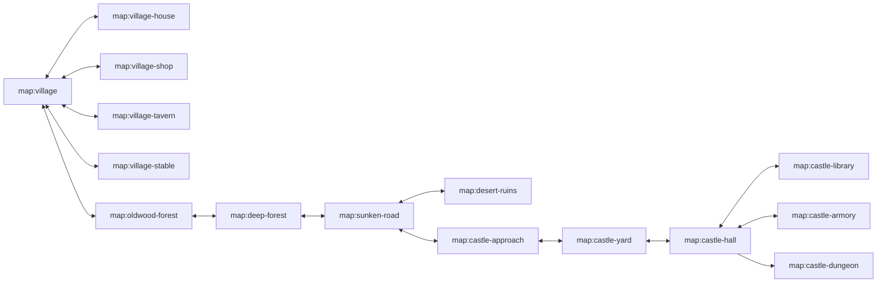

# World Plan

The world content now serves the incremental rescue loop defined in
`docs/INCREMENTAL-RESCUE-LOOP.md`. The expanded journey is a source library of
storybook roads, interiors, NPCs, props, enemies, and route consequences that
can be unlocked into repeated princess-rescue runs. Every region remains
content-first: maps live in `src/content/world/maps`, dialogue and quests live
in `src/content/story`, and code only interprets the content contract.

## Incremental Positioning

The baseline run is one bottom-to-top rescue route: player south, princess
north, dragon as guardian, then a between-run upgrade graph. The existing long
route is not discarded; it is recast as unlockable route packs:

- Hearthwake Village becomes the warm opening-route modifier, economy source,
  and service cluster.
- Oldwood and Deep Forest become branching path pressure, safe-passage
  objectives, and rose-awarding road mastery.
- Sunken Road and Desert Ruins become optional hazard/shortcut packs.
- Castle Approach becomes the siege-threshold route pack.
- Castle interiors become rose-gated side loops or late-run route mutations
  rather than mandatory navigation before every rescue.

## Current Runtime Status

As of S9.4, a new game boots straight into `map:rescue-route` — the compact
bottom-to-top baseline run defined by `incremental.loop.startMap`. The knight
spawns at the south edge, a serpentine path climbs north past trash-mob coin
fights, the route dragon (`dragon-guardian`, a winnable 60 hp first guardian —
the Shadow Warlord remains the dungeon boss) holds the pass below the princess
plateau, and freeing Princess Amber (`quest:rescue-run`) pays the rescue roses
and opens results → upgrade graph. The authored Hearthwake-to-dungeon road
remains fully playable as the route-pack library; browser journey coverage
seeds it from a save slot instead of New Game. S9.5 then proves a second run
visibly changes after a purchased upgrade.

### Miniboss Ladder

Every route pack fields a named miniboss with a bespoke `.pix` design and an
authored placement; the dragon stays the final guardian. Every clear pays a
significant coin purse (`runRewards.minibossDefeated`); the FIRST clean clear
of each miniboss deterministically pays a rose and is remembered in
`defeatedMinibossIds` — repeat clears pay coins only, so rose pacing never
depends on luck.

| Route pack | Miniboss | Placement |
| --- | --- | --- |
| oldwood | Bramble Tyrant (`bramble-tyrant`) | upper thicket off the Oldwood road |
| deep-forest | Glowcap Matron (`glowcap-matron`) | southern glowcap hollow |
| sunken-road | Desert Wyrm (`desert-wyrm`) | the sandwyrm wash |
| castle-approach | Banner Knight (`banner-knight`) | the guarded gate road |
| castle-interior | Armory Sentinel (`armory-sentinel`) | the armory's dark corner |

### Rescue Route Map Contract

`map:rescue-route` is 26x64 tiles (416x1024 px, ~2-3.5 minutes with fights at
144 px/s): grass base, mountain border, serpentine path spine with two bends,
a water pocket off the east shoulder, a castle-road slab plateau for the
princess at the north, terrain families (grass, path, mountain, water,
castle-road) painted by deterministic chunks, and authored waypoint props. Trash mobs (forest orcs, raiders, a
scout) line the path as the coin engine; the dragon is the only authored boss
placement.

## Region Map

| Region | Map ids | Role | Tone |
| --- | --- | --- | --- |
| Hearthwake Village | `map:village`, `map:village-house`, `map:village-shop`, `map:village-tavern`, `map:village-stable` | opening hub, tutorial NPCs, save/load mental model, optional lived-in micro-spaces | warm vellum, chimney smoke, gentle tune |
| Oldwood Forest | `map:oldwood-forest`, `map:deep-forest` | first combat and branching errand chain | green canopy, rustling percussion, cautious patrols |
| Sunken Road Desert | `map:sunken-road`, `map:desert-ruins` | key hunt, ranged enemies, environmental gates | ochre, low strings, mirage shimmer |
| Castle Approach | `map:castle-approach`, `map:castle-yard` | escalation, guarded gate, exterior siege props | dusk brass, drums, tighter paths |
| Castle Interior | `map:castle-hall`, `map:castle-library`, `map:castle-armory` | exploration, dialogue reveals, heraldic room verbs | candlelit stone, echoing arpeggios |
| Dungeon | `map:castle-dungeon` | final combat, rescue payout, results entry | cold stone, low drones, boss pressure |

## Portal Graph

Portal triggers are map triggers with `kind: "portal"`. They must carry:

- `toMap`: destination map id.
- `toSpawn`: named spawn id in the destination map.
- `label`: player-facing door/road name for debugging and tests.
- `requiresFlag`, when the doorway is story-locked.
- `sfx`, normally `interact` unless a region owns a stronger cue.

Destination maps expose `spawns`, a dictionary of named positions. `default`
always exists and equals `playerSpawn`; every portal destination must resolve
to a named spawn. This allows two-way interior doors without hard-coded
coordinates in app code.

## Route-Pack Quest Library

The expanded quest arc remains authored content, but it is no longer the
product baseline. It is a library of route-pack beats, objectives, side loops,
and rose/coin opportunities that can be unlocked around the repeatable rescue
run.

| Act | Quest | Map coverage | Route-pack use |
| --- | --- | --- | --- |
| 1 | `quest:morning-errands` | village, house, shop, tavern | opening hub objectives, service tutorial, Continue/save mental model |
| 1 | `quest:broken-bridge` | village, oldwood forest | early route repair, forest threshold, common-coin activity |
| 2 | `quest:oldwood-oath` | oldwood forest, deep forest | road mastery, combat counters, rose-worthy forest branch |
| 2 | `quest:lost-page` | tavern, deep forest, library clue | class-route flavor between ranger trail and wizard clue |
| 3 | `quest:dungeon-key` | sunken road, desert ruins | hazard shortcut/key route pack and optional ruin side loop |
| 3 | `quest:castle-letters` | castle approach, yard, hall, library, armory | rose-gated castle evidence side loop |
| 4 | `quest:rescue-amber` | castle hall, armory/library, dungeon | princess rescue payout, dragon/boss pressure, results entry |

The playthrough test grows with each act. It must use only player controls:
keyboard A/B and directional input or the virtual pad/buttons.

## Hearthwake Shop Economy

Keeper Brindle's shop is an NPC counter, not a chest room. Its first sample
cake remains a one-time story kindness, but the post-sample interaction opens a
content-authored counter:

- Shop files live in `src/content/shops/*.json` and own the keeper, display
  name, listings, buy prices, sell prices, and transaction SFX.
- Listings point at `item:*` ids. Items remain the semantic inventory entries;
  the shop only prices and presents them.
- The player owns an inventory trait and gold trait. A buys the selected
  listing, B sells one owned copy of the selected listing, and up/down changes
  selection. React displays the counter; the sim owns all gold/inventory
  mutation.
- The shop room must include authored shelf/counter props and at least one
  additional talkable villager so the interior reads as a lived place rather
  than a colored box.
- Browser validation must enter the shop through public controls, speak with
  Brindle, open the counter, buy, sell, and observe gold/inventory changes.

## Map Contracts

- Exterior maps are larger than interiors and may include enemy spawn tables.
- Interior maps are compact, readable, and have no persistent HUD panels other
  than the top line; doors must not hide behind the on-screen controls.
- Door apertures must be at least five tile rows/cols when the player hitbox
  needs to pass through a wall-like boundary.
- Every map has a `bgmTheme`; the village slice uses authored `village` and
  `interior` ToneJS themes from `src/config/audio.json`.
- Every map has `spawns.default`; portal destinations use named spawns.
- Every portal is reversible unless explicitly gated by story flags.
- Every story gate has both collision behavior and a visible indicator.
- The minimap covers the current map only; changing maps resets exploration
  display to that map's own explored set.

## Authored Pixel Diorama Vocabulary

The 2.5D forced-perspective style does not require imported 3D assets before
the world can feel richer. The first expansion pass should author more native
pixel content and let the r3f diorama pipeline project it into depth:

- **Buildings:** cottage, shop, tavern, chapel/gatehouse, stable, castle
  outbuildings. Each should have a map footprint, facade prop, roof color,
  doorway portal, and minimap silhouette.
- **Trees and roadside props:** broadleaf trees, stump, signpost, fence,
  well, cart, barrels, crates, beds, tables, shelves, hearths, lanterns, and
  banners. These should be content JSON props with reusable draw ops, not
  hard-coded JSX or one-off CSS.
- **NPC silhouettes:** villagers, keeper, page, guard, hermit, desert pilgrim,
  castle scribe. Palette swaps are acceptable when the silhouette still reads
  as a different role.
- **Forced-perspective polish:** exterior facades sit as upright billboards
  with foot anchors; roofs/upper floors can be shorter stacked billboards with
  slight depth offsets. Interior furniture remains flatter and denser so phone
  screens stay readable.
- **Asset library use:** commercial/local asset packs are reference material
  and optional source material. They should not block authored 16-bit content
  that fits this game's language more directly.

## Implemented Slice History

The numbered slices below are implementation history and content standards
already absorbed into the route-pack library. They are not the current product
loop by themselves; the active queue and remaining work live in
`.agent-state/directive.md`.

## First S6 Slice

The first implemented depth slice is village interiors:

1. Add portal-capable schema/types/runtime.
2. Add `map:village`, `map:village-house`, `map:village-shop`, and
   `map:village-tavern`.
3. Add browser tests that enter a village interior and return through the same
   visible controls.
4. Keep the then-existing original journey playable while the expanded route
   grows.
5. Drive the interior journey with the player governor from
   `docs/PLAYER-GOVERNOR.md`, not with private sim writes or coordinate
   teleports.

## Second S6 Slice

The implemented exterior-road depth slice added route length:

1. Add `map:oldwood-forest`, `map:deep-forest`, and
   `map:castle-approach` as authored exterior maps.
2. Connect village east road to Oldwood, Oldwood to Deep Forest, and Deep
   Forest to Castle Approach with reversible `kind: "portal"` road-edge
   triggers.
3. Add at least one forest ground tile, one castle-road tile, and new
   storytelling props for signs, stumps, and castle approach staging.
4. Preserve the then-proven route until the expanded questline replaces it in
   S6.6.
5. Add a focused browser route test that uses the player governor and public
   directional input to travel from Hearthwake Village to Castle Approach.

## Third S6 Slice

The quest-depth slice turns the expanded route into a playable errand chain
with named people and midpoint objectives:

1. Add `quest:morning-errands`, a village fetch loop that starts only when the
   player enters Hearthwake Village, sends the player from Page Pip to Keeper
   Brindle, and resolves back at the village green without polluting the
   original overworld playthrough log.
2. Add `quest:oldwood-oath`, a multi-counter Oldwood quest that starts on
   `map:oldwood-forest`, introduces the Oldwood Hermit, counts forest raiders,
   and finishes only after the player carries the oath toward the deeper road.
3. Add `quest:lost-page`, an escort-lite Deep Forest quest where Lost Page
   Rowan is guided by player movement through a landmark zone and then back
   toward the west road.
4. Add `char:page`, `char:hermit`, and `char:lost-page` with dialogue banks
   that resolve through the normal state-conditioned slot system.
5. Validate the slice through both reducer tests and headed browser tests that
   use the player governor's real A-button and directional controls.

## Fourth S6 Slice

The enemy-depth slice makes each region play differently without breaking the
storybook road readability on phone screens:

1. Add a JSON difficulty curve in `src/config/enemies.json` that orders
   region pressure from Oldwood patrols through castle sentries and the final
   dungeon. The curve owns region ids, map ids, tier, threat score, and the
   enemy archetypes expected on each map.
2. Oldwood Forest uses readable patrol pressure: `oldwood-raider` guards
   clearings with normal patrol aggro while `thorn-shaman` adds slow ranged
   denial near the edges of the road.
3. Deep Forest introduces ambush behavior: `bramble-stalker` waits until the
   player enters its trigger range, then uses Yuka seek steering as a sudden
   close-range chase. This makes the deeper woods feel different from the
   opening forest without filling the direct route with unavoidable damage.
4. Castle Approach introduces guarded-leash behavior: `gate-sentry` and
   `banner-knight` commit near their posts, then return to the gate instead of
   chasing across the whole map. This keeps the approach tense while preserving
   the player-governed route test.
5. Dungeon enemies remain relentless and boss-led. Their curve entry must be
   stronger than the approach entry and must keep the then-proven rescue
   encounter intact while S6.6 expands the end-to-end journey through the new
   route.

Enemy AI remains config-first. Code may add general Yuka behavior interpreters
such as `ambush` and `guard`, but individual placement, palette, hitbox, speed,
range, cooldown, and projectile data live in JSON.

## Fifth S6 Slice

The expanded playthrough slice replaced the earliest route proof with a
single start-to-results journey through the authored road:

1. New Game starts in `map:village`, not the legacy `map:overworld`.
2. The required route is Hearthwake Village, Oldwood Forest, Deep Forest,
   Sunken Road, Castle Approach, and Obsidian Throne Dungeon.
3. `quest:oldwood-oath` starts the key hunt after the player carries the oath
   beneath the east bough; the legacy bridge quest remains playable in
   `map:overworld` but no longer gates the main expanded route.
4. `map:sunken-road` owns the Sandwyrm key fight around a broken caravan wash:
   shallow water, broken stone footings, sandstone ruin teeth, and wrecked cart
   props make it a story landmark rather than another straight corridor.
   Deep Forest routes into Sunken Road, and Sunken Road routes into Castle
   Approach.
5. Castle Approach owns the key-gated castle entry portal. `quest:dungeon-key`
   can complete from the Castle Approach gate as well as the legacy overworld
   gate, then the route must pass through the castle yard and hall before the
   dungeon.
6. `tests/browser/playthrough.test.tsx` must prove the full route through real
   keyboard A/B and directional input only, including the rescue results screen
   and between-run upgrade entry.

## Sixth S6 Slice

The castle-interior slice turns the key gate into a short authored dungeon
approach instead of a single teleport from road to final room:

1. Add `map:castle-yard`, `map:castle-hall`, `map:castle-library`, and
   `map:castle-armory` with reversible portals, named spawns, and no hidden
   spawn-inside-door loops.
2. Change `map:castle-approach` so the key-gated `trigger:castle-gate-entry`
   leads to `map:castle-yard`; `map:castle-hall` then owns the final portal
   into `map:castle-dungeon`.
3. Add a castle scribe NPC and `quest:castle-letters`: the player speaks with
   the scribe, visits the library archive, visits the armory standard, returns
   to the scribe, and receives the visible all-clear before entering the
   dungeon.
4. Add authored castle props for banners, shelves, lanterns, weapon racks, and
   throne doors. These must use outlined pixel grids with at least five visible
   channels; flat rectangles do not count.
5. Expand the headed browser playthrough so the main journey reaches the
   dungeon only after entering the yard, hall, library, and armory through
   real directional input and A-button dialogue.
6. Read fresh screenshots for the castle approach/hall route before accepting
   the slice, because the 2.5D camera can magnify large wall props into unreadable
   slabs.

## Seventh S6 Slice

The desert-ruins slice turns the Sunken Road landmark into an explorable
interior instead of a background suggestion:

1. Add `map:desert-ruins` as a reversible interior off `map:sunken-road` with
   a named `from-ruins` return spawn that lands outside the entry trigger.
2. Use authored ruin-floor, mural, shrine, and arch content so the room reads
   as old road history rather than another rectangular box.
3. Add a desert pilgrim NPC and mural trigger. The player can enter the ruin,
   walk to the mural, receive a short lore dialogue, and return to Sunken Road
   through public directional input and A-button dialogue.
4. Keep the main rescue route direct: the Sunken Road east-road trigger still
   reaches Castle Approach, and the ruins are a readable landmark loop rather
   than a required detour for the current key quest.
5. Capture fresh desktop and phone screenshots of the ruin interior before
   accepting the slice.

## Eighth Content-Depth Slice

Hearthwake Village is the player's first proof that the game is an adventure,
not a corridor. The market-day slice thickens the starting village before the
road pulls east:

1. Add a small market cluster to `map:village` using authored stall, board, and
   flower-cart props placed around the well and road.
2. Add named townsfolk with dialogue banks so the village has more voices than
   the required quest NPCs.
3. Keep the east-road route readable and passable for the player governor.
4. Add a headed browser test that starts from a save, walks to a market
   townsperson through public controls, presses A, and reads the dialogue.
5. Capture desktop and phone screenshots of the market cluster before accepting
   the slice, with mobile still preserving the gameplay-area budget.

## Ninth Content-Depth Slice

Market density should not stop at static props. The first-town NPC motion slice
adds authored walking loops without changing the player's public controls:

1. Extend map entity content with optional NPC patrol points and a speed.
2. Interpret those patrol points through a Yuka-backed NPC steering system,
   feeding the same `MoveIntent`/movement pipeline as enemies and the player.
3. Give Tobin Bell a short market-board loop while leaving Mara Cress stationary
   for the A-button dialogue browser route.
4. Unit-test deterministic NPC patrol movement and keep the headed market
   browser test green.

## Tenth Content-Depth Slice

Hearthwake still needs ordinary life around the road so the first screen reads
as a storybook place, not a junction with buildings. The livelihood slice adds
small domestic set dressing and another town voice:

1. Add authored village props for a vine trellis, bakery oven, laundry line, and
   seed crates. These must use outlined pixel grids with several channels so
   they read as objects, not flat color signs.
2. Place the props around the existing house, shop, tavern, and market roads
   without blocking the east-road playthrough route or the market dialogue test.
3. Add a named Hearthwake NPC whose dialogue points at the new village details
   and reinforces the old-fashioned errand tone.
4. Add unit coverage that proves the doc, prop ids, character, dialogue bank,
   and village placements all exist as content.
5. Add headed browser validation that walks to the new townsperson through
   public controls, presses A, and captures a screenshot of the denser village.

## Eleventh Content-Depth Slice

The first exterior road must feel like Oldwood, not a straight hallway with a
forest texture. The road-shape polish slice adds landmark clusters around the
existing route while preserving the proven public-control traversal:

1. Add authored forest props for a mossy waystone, fallen log, bramble hedge,
   and lantern post. Each prop needs outlined pixel detail and at least five
   recolor channels.
2. Place the landmarks around `map:oldwood-forest` and `map:deep-forest` so
   the player sees bends, clearings, and roadside history before combat starts.
3. Keep the direct route passable for the player governor and the full
   start-to-results playthrough.
4. Add unit coverage for the doc, prop ids, and map placements.
5. Add headed browser validation that enters Oldwood through public controls,
   walks to the first landmark cluster, and captures desktop and phone evidence.

## Twelfth Content-Depth Slice

The player governor needs to plan against authored affordances, not only
coordinates. The tavern-governor slice makes `map:village-tavern` a social
interior with enough visible state for a goal/action loop to choose route and
interaction acts:

1. Add an Unfurled Vine tavern cluster with benches, hearth-song detail, and a
   story-quilt prop so the room reads as a gathering place instead of a dark
   rectangle with tables.
2. Add a named tavern NPC whose dialogue points at the room details and gives a
   storybook reason for the road to begin in public life.
3. Expand the test-side player governor with a small planner over public
   perception and content-authored action descriptors: enter a map, walk to an
   affordance point, press A, and verify visible dialogue.
4. Add unit coverage for the new planner contract plus tavern content ids,
   placements, character, and dialogue.
5. Add headed browser validation that starts from a real save, lets the
   governor plan into the tavern through public controls, talks to the tavern
   NPC, and captures desktop plus phone evidence.

## Thirteenth Content-Depth Slice

The tavern should become playable story, not just scenery. The notice-board
questlet slice turns the hearth-song board into a readable prop and uses the
quest graph to send the player back to Merrin:

1. Extend prop interaction content so a prop can request a dialogue bank/slot
   through the same dialogue outbox used by NPCs and quest effects.
2. Make `prop:hearth-song-board` readable with A, emitting a dialogue event
   from a dedicated board voice.
3. Add `quest:tavern-song` as a short start-on-enter quest: read the board,
   ask Merrin what the verse means, then set a completion flag.
4. Add Merrin dialogue slots for the questlet stage and after-state so the
   tavern reacts to the board being read.
5. Add planner-driven browser validation that enters the tavern, reads the
   board, talks to Merrin, and verifies the quest log changes through public UI.

## Fourteenth Content-Depth Slice

Readable props should not stay confined to interiors. The main road needs
landmarks the player can inspect while traveling, with quest-log consequences
that prove the detail is playable:

1. Make the Oldwood mossy waystone readable with A and a dedicated voice bank.
   The `quest:oldwood-waystone` log starts on Oldwood entry and completes when
   the marker is read.
2. Make the Sunken Road broken cart readable with A and a dedicated voice bank.
   The `quest:sunken-cart-ledger` log starts on Sunken Road entry and completes
   when a cart is read.
3. Keep both interactions content-authored through prop `interaction.dialogue`;
   no bespoke React UI or private sim calls.
4. Add unit coverage for docs, prop metadata, dialogue banks, quests, flags,
   and quest runtime progression.
5. Add headed browser validation that uses the player governor to enter or
   resume each route, walk to the readable prop, press A, assert visible
   dialogue/log changes, and capture desktop plus phone evidence.

## Fifteenth Content-Depth Slice

Readable clues should change later play. The first consequence pass makes the
Oldwood waystone matter when the player reaches the Hermit:

1. Add a flag-gated Hermit dialogue branch for
   `flag:oldwood-waystone-read` while `quest:oldwood-oath` is still at
   `find-hermit`.
2. Keep the same accepted choice event (`dlg:hermit.oath:accepted`) so the
   quest graph remains data-driven and the full route still advances.
3. Update the full public-control playthrough to read the waystone, then prove
   the Hermit reacts to that prior inspection.

## Sixteenth Content-Depth Slice

Readable objects should answer the player's button press with more than text.
The affordance pass turns inspection into a visible and audible action:

1. Extend prop `interaction` content with `feedback.anim`, an `anim:*`
   reference consumed by the renderer when the prop is inspected.
2. Add a short manuscript-style inspection pulse animation for readable props;
   it should read as storybook emphasis, not neon UI or CRT effects.
3. Keep the existing content-authored SFX path for readable props and verify
   that A-button inspection increments the ToneJS SFX debug counter.
4. Prove the pulse through browser tests driven by the player governor: walk to
   route readables, press A, assert the prop reports a fresh feedback pulse, and
   capture desktop/phone evidence from the headed browser.
5. Fold the feedback check into the full public-control playthrough at the
   waystone read so the start-to-finish journey validates inspection as a game
   action, not only dialogue.

## Seventeenth Content-Depth Slice

Hearthwake must feel like a village that existed before the player arrived. The
stable-yard slice adds an optional working space beside the main route so the
opening hub has more than cross paths, quest boxes, and static facades:

1. Add `map:village-stable` as a compact reversible interior off
   `map:village`, with an entry spawn and a `from-stable` village return spawn
   outside the outbound trigger.
2. Add a Hearthwake Stable facade plus authored tack, hay, oat-bin, and stall
   props. Each prop must use outlined pixel grids with at least five visible
   channels so the scene reads as old-fashioned craft rather than flat color.
3. Add a named stablehand NPC with dialogue about saddle-bells, oats, and the
   eastern road. The stable must have a social verb, not just scenery.
4. Keep the player governor's direct village-to-Oldwood route passable while
   adding the stable as a short optional detour to the full public-control
   playthrough.
5. Add headed browser validation that enters the stable through real movement
   controls, presses A near the stablehand, verifies visible dialogue, and
   captures desktop plus phone evidence with the phone HUD still leaving most of
   the viewport to gameplay.

## Eighteenth Content-Depth Slice

Village services should become verbs, not only scenery or one-off dialogue. The
stable-service slice reuses the content-authored shop counter outside Brindle's
room so Hearthwake has a second place where A/B input changes inventory and gold:

1. Add `shop:oswin-stable-counter`, kept by `char:oswin-hayward`, with authored
   listings for stable goods and the same A-buy/B-sell public control contract
   as Brindle's counter.
2. Add at least one stable-specific item to `src/content/story/items.json` so
   the service does not feel like a reskinned cake shelf.
3. Change Oswin's dialogue so the stable greeting opens the counter after the
   player advances the line, preserving the named social verb and turning it into
   a service interaction.
4. Add unit coverage for the shop, item, dialogue `opensShop`, and generic
   buy/sell reducer path using the new counter.
5. Add headed browser validation that reaches Oswin through public movement,
   opens the counter, buys with A, sells with B, closes the public panel, and
   returns to the village route.

## Nineteenth Content-Depth Slice

Service verbs must leave story fingerprints. The first service-consequence pass
makes Oswin's oat purchase matter after the counter closes:

1. Emit generic `shop:buy` and `shop:sell` events from the shop reducer with the
   shop id, listing id, and item id so quests can listen to service verbs without
   bespoke UI code.
2. Add `quest:stable-oat-kindness`, an auto-start quest that completes when the
   player buys `oat-bundle` from `shop:oswin-stable-counter` and sets
   `flag:stable-oats-bought`.
3. Add a Page Pip dialogue branch for `flag:stable-oats-bought` during
   `quest:morning-errands/find-page`. The branch must still emit
   `dlg:page.errand` so the existing morning errand route remains data-driven.
4. Add reducer coverage that proves a shop transaction can advance a quest and a
   dialogue slot can react to the resulting flag.
5. Expand headed browser validation so the stable service purchase is followed
   by a later Page Pip response in the full public-control playthrough.

## Twentieth Content-Depth Slice

The stable consequence must echo outside Hearthwake and make the first road feel
more authored than a path with obstacles:

1. Add an Oldwood roadward scene beside the first forest bend: a named NPC,
   `char:oldwood-roadward`, plus at least two outlined route props with visible
   blue oat-string, stool, ledger, cloth, or lantern details.
2. Add `quest:oldwood-oat-token`, a quiet auto-start route-reward quest that
   opens only after the player buys `oat-bundle` from
   `shop:oswin-stable-counter`. Its visible stage asks the player to show
   Oswin's blue oat-string to the Oldwood roadward.
3. Make the roadward dialogue branch from the opened quest, complete the reward
   on `dlg:oldwood-roadward.oat-token:accepted`, set
   `flag:oldwood-roadward-mark`, and play an authored service payoff sound.
4. Add a Hermit branch for `flag:oldwood-roadward-mark` while preserving the
   existing `dlg:hermit.oath` event and "drive two raiders" quest edge.
5. Expand headed browser validation and the full public-control playthrough so
   the player buys the stable service, reaches Oldwood, receives the roadward
   response, and sees the Hermit acknowledge the road mark.

## Twenty-First Content-Depth Slice

Deep Forest must stop reading as a pass-through lane between Oldwood and the
desert. The next visual-story density pass adds a working road-life scene on the
mandatory route:

1. Add `char:fern-mender`, a named moving NPC on the Deep Forest lower track,
   with a content-authored Yuka patrol loop and dialogue bank
   `dlgbank:fern-mender`.
2. Add at least two bespoke Deep Forest props, `prop:fern-mender-cart` and
   `prop:glowcap-ring`, with outlined pixel grids and five or more visible
   recolor channels each so the scene reads as hand-authored set dressing.
3. Add `quest:deep-forest-fern-light`, a short route questlet that starts on
   `map:deep-forest`, asks the player to speak with Linnet Fernwise, completes
   on `dlg:fern-mender.start:accepted`, and sets
   `flag:fern-mender-greeted`.
4. Add unit coverage for prop richness, map placement, the patrol trait/Yuka
   movement, dialogue/quest reduction, and registry counts.
5. Add headed browser validation with desktop and phone evidence, then expand
   the full public-control playthrough so the player stops at the fern-mender
   before crossing into Sunken Road.

## Twenty-Second Content-Depth Slice

Hearthwake still has too much straight-path geometry around the first shop, and
the player should meet working storefront life before stepping into another box.
The next shop-and-street depth pass turns the outside of Brindle's shop into a
roadside commerce scene:

1. Add `prop:shop-awning`, `prop:road-goods-cart`, and
   `prop:chalk-price-board` to `map:village`, each with outlined pixel grids and
   five or more visible recolor channels so the shopfront reads as authored
   merchandise rather than flat color blocks.
2. Add `char:road-cart-trader`, a named moving trader whose content-authored
   Yuka patrol loops around the shopfront and market road without blocking the
   east-road path.
3. Add `shop:road-cart-counter`, opened from `dlgbank:road-cart-trader`, with a
   cheap `item:wayfarer-ribbon` listing so A-buy/B-sell storefront verbs happen
   outside an interior room during the actual journey.
4. Break up the shop crossroad with extra cobble/set tiles and road-cart props
   placed in the player's depth band while preserving all existing village
   portals and the east-road route.
5. Add unit coverage for prop richness, map placement, Yuka movement, dialogue
   `opensShop`, and the generic shop reducer; add headed desktop/phone browser
   evidence and expand the full public-control playthrough so the player buys
   and sells at the road-cart before leaving Hearthwake.

## Twenty-Third Content-Depth Slice

The village street should keep shrinking from a big cross into small lived-in
thresholds. The next route-composition pass adds a non-shop interaction that
changes a later social line:

1. Add `prop:village-letter-basket`, `prop:stoop-lantern`, and
   `prop:dooryard-flower-stand` to `map:village`, placed around the shop/Page
   approach so the road has doorstep scale in the player's depth band.
2. Add `char:village-letter-basket` and `dlgbank:village-letter-basket`; the
   letter-basket is readable with A, plays `inspect`, pulses with
   `anim:inspect-pulse`, and emits `dlg:village-letter-basket.note:seen`.
3. Add `quest:village-letter-basket`, started on `map:village`, that completes
   when the letter is read and sets `flag:village-letter-basket-read`.
4. Add a Page Pip branch for `quest:morning-errands` + `find-page` +
   `flag:village-letter-basket-read` so the non-shop inspection changes a later
   village line while preserving the original `dlg:page.errand` quest event.
5. Add unit coverage for prop richness, map placement, quest/flag reduction, and
   the Page branch; add headed desktop/phone evidence and extend the full
   public-control playthrough so the player reads the basket before talking to
   Page Pip.

## Twenty-Fourth Content-Depth Slice

Sunken Road still risks reading as a straight boss lane with caravan dressing.
The route-encounter variety pass adds a working road encounter after the wash,
where the player meets a moving courier in a shaded layby before carrying the
warning onward to the castle:

1. Add `char:sunken-courier`, a named moving NPC on `map:sunken-road`, with a
   content-authored Yuka patrol around a low shade rig and water stand.
2. Add `prop:shade-cloth-rig`, `prop:water-jar-stand`, and
   `prop:wind-ribbon-cairn`, each using outlined pixel grids with at least five
   visible recolor channels so the layby reads as a hand-authored route stop
   instead of another flat colored box.
3. Add `quest:sunken-courier-warning`, started on `map:sunken-road`, that asks
   the player to speak with the courier, completes on
   `dlg:sunken-courier.warning:accepted`, sets
   `flag:sunken-courier-warned`, and plays a route-interaction sound.
4. Add a `flag:sunken-courier-warned` castle-scribe briefing branch that still
   emits `dlg:castle-scribe.briefing` so the required castle-letter quest
   remains on the same graph edge.
5. Add unit coverage for documentation, prop richness, map placement, Yuka
   movement, quest/flag reduction, and the later scribe payoff; add headed
   desktop/phone browser evidence and expand the full public-control
   playthrough so the player meets the courier before the castle.

## Twenty-Fifth Content-Depth Slice

The route-art silhouette pass reduces the remaining empty upper bands visible
in Oldwood and Sunken Road screenshots. It adds authored silhouettes that sit
above the player lane without stealing control space, and it pairs the Oldwood
art pass with a moving social encounter so the route gains a verb instead of
another passive marker:

1. Add `char:oldwood-thorncutter`, a named moving NPC on
   `map:oldwood-forest`, with a content-authored Yuka patrol around the upper
   hazel pocket and dialogue bank `dlgbank:oldwood-thorncutter`.
2. Add `prop:hazel-arch`, `prop:thorncutters-bundle`,
   `prop:sand-sail-wreck`, and `prop:sunken-pillar-shadow`, each with outlined
   pixel grids and at least five visible recolor channels.
3. Shape the Oldwood upper road with smaller non-rectangular path pockets and
   place the Sunken Road silhouettes in the upper band shown by desktop
   screenshots, leaving the direct public-control route passable.
4. Add `quest:oldwood-thorncutters-lantern`, started on
   `map:oldwood-forest`, that completes through the thorncutter dialogue and
   sets `flag:oldwood-thorncutter-greeted`.
5. Add unit coverage for docs, prop richness, map placement, Yuka movement, and
   quest/flag reduction; add headed browser evidence and expand the
   public-control playthrough so the Oldwood encounter is part of the main
   journey.

## Twenty-Sixth Content-Depth Slice

The first Castle Approach route window should stop relying on an open-space
exception. The composition-driven route revision turns that exposed arrival
road into a small working wayside encounter:

1. Add `char:approach-pilgrim`, a named moving NPC near the western Castle
   Approach road, with dialogue bank `dlgbank:approach-pilgrim`.
2. Add `prop:wayside-cloak-stand` and `prop:pilgrim-kettle`, each using
   outlined pixel grids with at least five visible recolor channels.
3. Add a small non-rectangular west-road tile pocket so the first approach
   window has visible surface variation before the gate.
4. Add `quest:approach-pilgrim-warning`, started on `map:castle-approach`, that
   completes through the pilgrim dialogue and sets
   `flag:approach-pilgrim-warned`.
5. Make Gwydion acknowledge that warning through a flag-gated dialogue branch
   while preserving the existing `dlg:gwydion.hint` event.
6. Update `composition.routeWindows` so the west approach no longer needs
   `openReason`, then prove the route with unit tests, headed browser evidence,
   and the public-control playthrough.

## Twenty-Seventh Content-Depth Slice

The composition budget tuning pass removes the remaining sparse-window
exceptions from the current mandatory exterior route and makes another quiet
stretch playable:

1. Tighten `composition.routeWindows` so current mandatory exterior maps cannot
   rely on `openReason`; new maps may still use it only as a temporary design
   exception while authoring catches up.
2. Turn Oldwood's quiet lantern walk into a worked road beat with
   `char:oldwood-lantern-keeper`, `quest:oldwood-lantern-keeper`, a public
   A-button greeting, and detailed lantern maintenance props in the player's
   depth band.
3. Add richer Deep Forest exit props before the Sunken Road threshold so the
   last lantern window reads as tended forest craft, not justified emptiness.
4. Promote mandatory exterior surfaces from single repeated tiles to
   deterministic terrain-family chunks: grass, path, leaf litter, village
   cobble, sand, and castle road each need four to eight authored 16x16 variants
   before the route-window screenshots count as acceptable evidence.
5. Prove the route-window budget through unit tests, headed browser evidence,
   and public A-button dialogue validation.

## Twenty-Eighth Content-Depth Slice

The second composition budget pass closes the terrain-family gaps the first
pass left open and gives the route's emptiest window an authored verb:

1. Tighten the route-window dominant-tile cap from 0.88 to 0.84. The four
   windows that leaned hardest on one semantic surface — Deep Forest's
   fern-mender track and last-lantern threshold, the Sunken Road wash, and
   Aveline's west wayside on the Castle Approach — gain authored secondary
   terrain instead of a looser budget.
2. Extend terrain families to every remaining repeated exterior surface:
   `tile:mountain` border crags, scree, and ledges across all five mandatory
   maps; `tile:water` glints, reeds, and deep pools on the Sunken Road wash;
   and `tile:stone-floor` cracked, mossy, and worn paving on the Castle
   Approach gatehouse threshold. Each family ships four hand-authored 16x16
   `.pix` variants painted by deterministic chunk noise.
3. Turn the Sunken Road wash-and-sandwyrm-wreck window into a worked beat with
   `char:sunken-road-wreck-picker`, `quest:sunken-road-wreck-picker`, a public
   A-button greeting that sets `flag:sunken-road-wreck-picked`, and salvage
   props in the player's depth band so the widest window on the route reads as
   a working salvage site, not justified emptiness.
4. Prove the tightened budget through unit tests, headed browser evidence, and
   public A-button dialogue validation.

## Content Depth Bar

The first playable world cannot remain a five-minute corridor. Each new map
slice must add at least one meaningful player-facing verb or story signal:

- Shops are NPC interactions first, not treasure boxes. The first keeper
  interaction gives a one-time travel-cake heal through the quest/effect
  pipeline, then the shop opens a content-driven buy/sell counter with player
  inventory and visible gold changes.
- Exterior maps should read as places: signage, stumps, trees, gatehouses,
  barrels, and NPCs placed around roads, not only long cross-shaped paths.
- Optional interiors off the main road need a clear reason to exist: a landmark
  prop, a talkable person or readable object, and a reversible exit.
- Road maps may keep a direct route for the player governor, but the tile plan
  should imply bends, clearings, landmarks, and branches that can hold
  upgrade-gated questlets.
- Mandatory exterior maps must declare `composition.routeWindows` per
  `docs/CONTENT-COMPOSITION.md`. Repeated grass, sand, leaf, or road carpets
  are not acceptable. Current route maps should use terrain-family chunks with
  four to eight variants per repeated surface; a new map may use an explicit
  travel or threshold reason only while that authored variant pass is being
  created.
- Every route expansion should add browser validation through real movement
  and A/B input before claiming depth.
